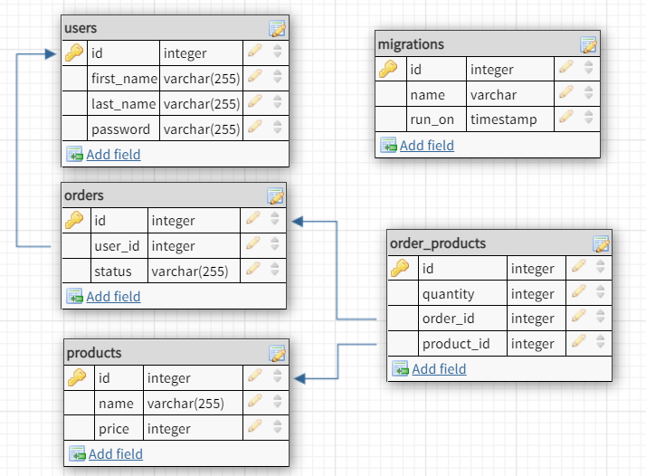

# API Requirements
## API Endpoints
The API accepts the endpoint body payload as json, users endpoints is tokenized so you need to use `/users/login` in order to get the token then append it in request header `Authorization: Bearer token`.
#### Products
- Index `get /products` 
- Show `get /products/:id` :id represent a precreated product id
- Create `post /products` [token required]
- Update `put /products/:id`
- Delete `delete /products/:id`

#### Users
- Index `get /users` [token required]
- Show `get /users/:id` :id represent precreated user id [token required]
- Create `post /users` [token required]
- Update `put /users/:id`
- Delete `delete /users/:id`
#### Orders
- Index `get /orders` [token required] get order for specific user, user is determined using token
- Create `post /orders` user is determind using token [token required]
- Show `get /orders/:id`
- Update `put /orders/:id`
- Delete `delete /orders/:id`
## Database schema 
#### products
-  id `integer`
- name `varchar`
- price `integer`

#### users
- id `integer`
- first_name `varchar`
- last_name `varchar`
- password `varchar`

#### orders
- id `integer`
- user_id `integer`
- status `varchar`

#### order_products
- id `integer`
- quantity `integer`
- product_id `integer`
- order_id `integer`

